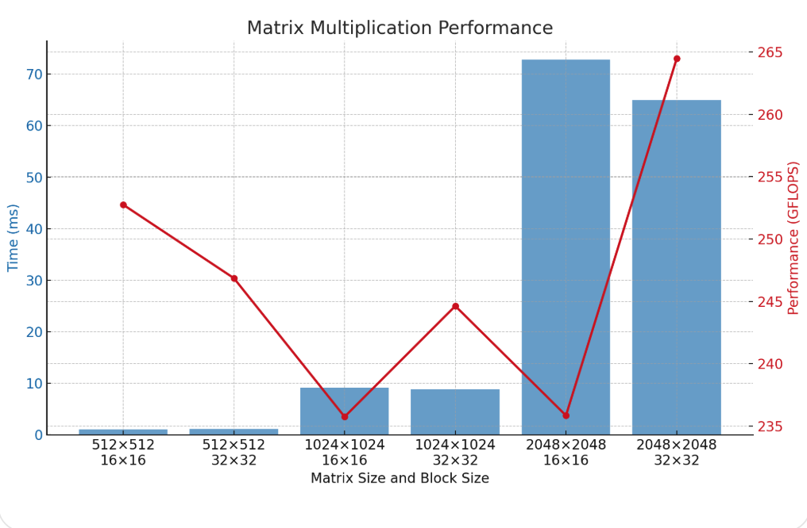
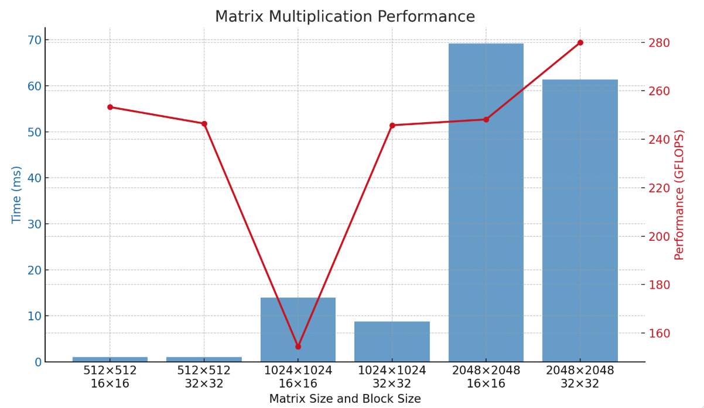
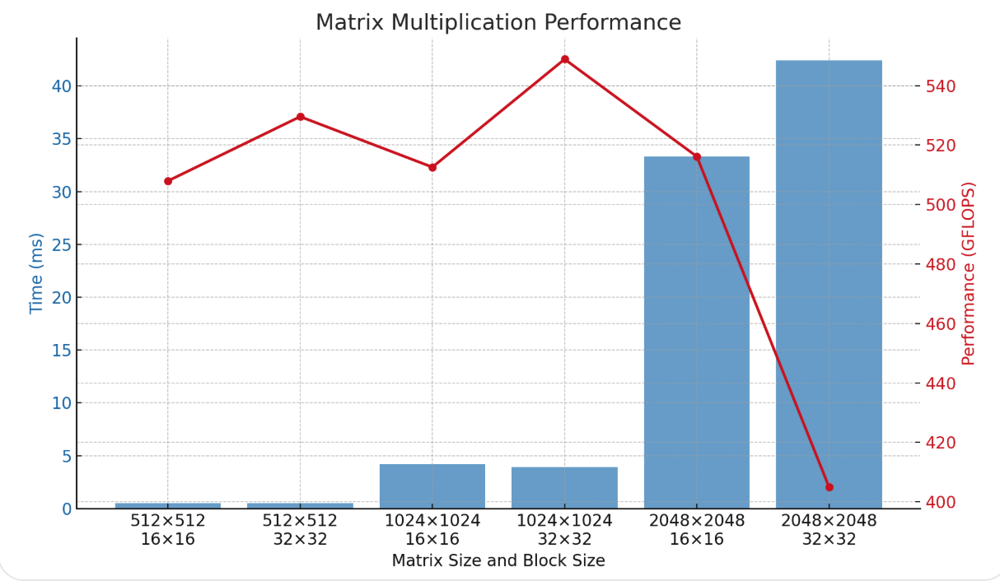
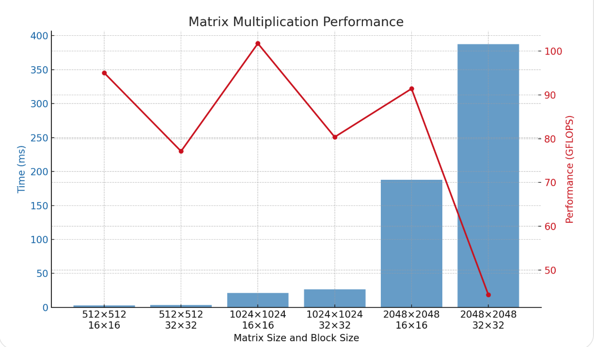
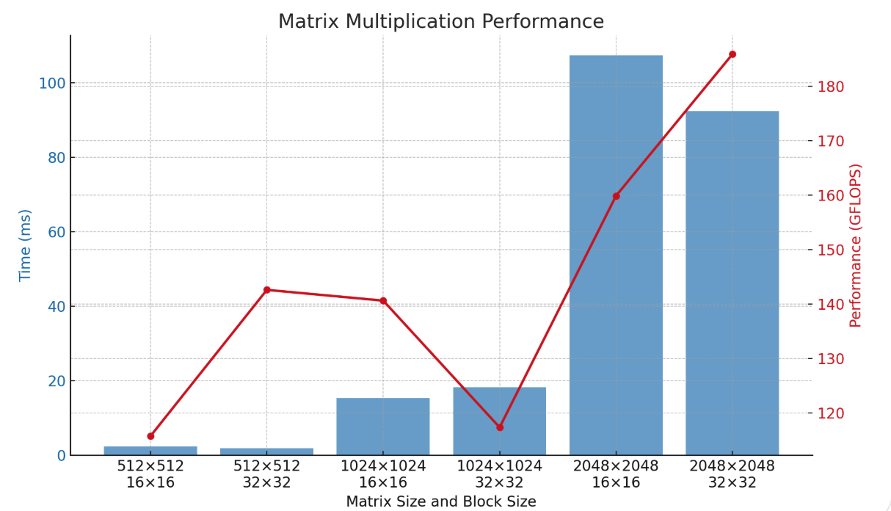
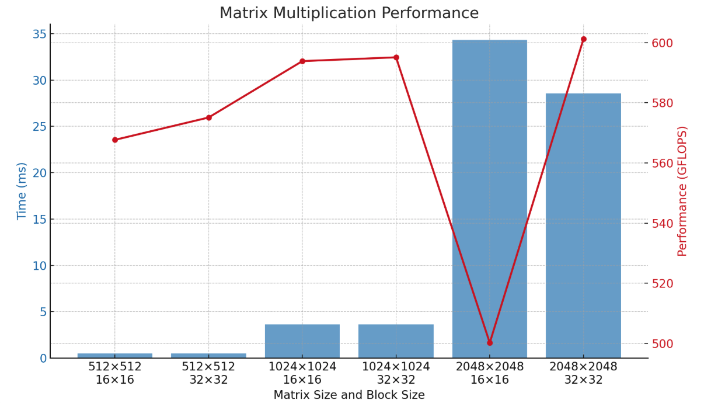

## Introduction

Hui Ma
hm223ab

* **Scope**: Detailed study of CUDA-based matrix multiplication performance across six kernel versions.
* **Metrics**: Execution time and GFLOPS across varying matrix sizes.
* **Objective**: Analyze how each optimization scales and impacts performance.
  
---

## Device Specifications

| Property                    | Value                           |
| --------------------------- | ------------------------------- |
| Total Global Memory         | 8 106 MB                        |
| Shared Memory per Block     | 48 KB                           |
| Registers per Block         | 65 536                          |
| Warp Size                   | 32                              |
| Max Threads per Block       | 1 024                           |
| Multi-Processor Count (SMs) | 14                              |
|Max threads per multiprocessor|2048|
## V1 – Baseline

### Result



> - The blue bars show the Time (ms) for each matrix size and block size.
> - The red line shows the corresponding GFLOPS performance.


| Matrix Size | Block Size | Time (ms) | GFLOPS |
| ----------- | ---------- | --------- | ------ |
| 512×512     | 16×16      | 1.062     | 252.75 |
| 512×512     | 32×32      | 1.087     | 246.86 |
| 1024×1024   | 16×16      | 9.109     | 235.75 |
| 1024×1024   | 32×32      | 8.779     | 244.63 |
| 2048×2048   | 16×16      | 72.842    | 235.85 |
| 2048×2048   | 32×32      | 64.962    | 264.46 |

### Code Snippet

```cpp
__global__ void V1_baselineKernel(const float* A, const float* B, float* C, int N) {
    int row = blockIdx.y * blockDim.y + threadIdx.y;
    int col = blockIdx.x * blockDim.x + threadIdx.x;

    if (row < N && col < N) {
        float sum = 0.0f;
        for (int k = 0; k < N; ++k) {
            sum += A[row * N + k] * B[k * N + col];
        }
        C[row * N + col] = sum;
    }
}
```

#### Technique: Naïve Global Memory Access

* Reads elements directly from global memory for each multiply-add.
* No tiling or caching; simple row-by-column dot-product.

#### Explanation:

* **Memory-bound**: Frequent reads from global memory dominate latency.
* **Compute underutilization**: Many warps idle waiting for memory.
* **Scales poorly**: Time grows quadratically with N.
* **Baseline for comparison**: Establishes reference GFLOPS (\~235–265). Only minimal code complexity.

---

## V2 – Loop Unrolling

### Result



> - The blue bars show the Time (ms) for each matrix size and block size.
> - The red line shows the corresponding GFLOPS performance.

| Matrix Size | Block Size | Time (ms) | GFLOPS |
| ----------- | ---------- | --------- | ------ |
| 512×512     | 16×16      | 1.060     | 253.28 |
| 512×512     | 32×32      | 1.089     | 246.49 |
| 1024×1024   | 16×16      | 13.905    | 154.44 |
| 1024×1024   | 32×32      | 8.738     | 245.78 |
| 2048×2048   | 16×16      | 69.227    | 248.17 |
| 2048×2048   | 32×32      | 61.388    | 279.86 |

### Code Snippet

```cpp
__global__ void V2_loopUnrollKernel(const float* A, const float* B, float* C, int N) {
    int row = blockIdx.y * blockDim.y + threadIdx.y;
    int col = blockIdx.x * blockDim.x + threadIdx.x;

    if (row < N && col < N) {
        float sum = 0.0f;
        int k = 0;
        for (; k <= N - 4; k += 4) {
            sum += A[row * N + k] * B[k * N + col];
            sum += A[row * N + k + 1] * B[(k + 1) * N + col];
            sum += A[row * N + k + 2] * B[(k + 2) * N + col];
            sum += A[row * N + k + 3] * B[(k + 3) * N + col];
        }
        for (; k < N; ++k) {
            sum += A[row * N + k] * B[k * N + col];
        }
        C[row * N + col] = sum;
    }
}
```

#### Technique: Loop Unrolling

* Unrolls inner `k`-loop by factor of 4 to reduce branch overhead.
* More arithmetic per loop iteration.

#### Explanation:

* **Reduced loop control overhead**: Fewer branch checks improve throughput.
* **Mixed results**: Small matrices (\~512) see negligible change; large (1024,2048) improve slightly when block size=32.
* **Compute vs. memory**: Unrolling helps only when arithmetic latency hides memory fetches; limited by global memory.
* **Inconsistent scaling**: Performance benefit depends on block configuration.

---

## V3 – Shared Memory Tiling

### Result



> - The blue bars show the Time (ms) for each matrix size and block size.
> - The red line shows the corresponding GFLOPS performance.


| Matrix Size | Block Size | Time (ms) | GFLOPS |
| ----------- | ---------- | --------- | ------ |
| 512×512     | 16×16      | 0.528     | 507.94 |
| 512×512     | 32×32      | 0.507     | 529.57 |
| 1024×1024   | 16×16      | 4.190     | 512.58 |
| 1024×1024   | 32×32      | 3.912     | 548.89 |
| 2048×2048   | 16×16      | 33.285    | 516.15 |
| 2048×2048   | 32×32      | 42.425    | 404.94 |

### Code Snippet

```cpp
template <int TILE_SIZE>
__global__ void V3_sharedMemoryKernel(const float* A, const float* B, float* C, int N) {
    __shared__ float As[TILE_SIZE][TILE_SIZE];
    __shared__ float Bs[TILE_SIZE][TILE_SIZE];
    int row = blockIdx.y * TILE_SIZE + threadIdx.y;
    int col = blockIdx.x * TILE_SIZE + threadIdx.x;
    float sum = 0.0f;
    for (int t = 0; t < (N + TILE_SIZE - 1) / TILE_SIZE; ++t) {
        // Load tiles
        As[threadIdx.y][threadIdx.x] = (row < N && t*TILE_SIZE+threadIdx.x < N)
            ? A[row*N + t*TILE_SIZE + threadIdx.x] : 0.0f;
        Bs[threadIdx.y][threadIdx.x] = (col < N && t*TILE_SIZE+threadIdx.y < N)
            ? B[(t*TILE_SIZE + threadIdx.y)*N + col] : 0.0f;
        __syncthreads();
        for (int k=0; k < TILE_SIZE; ++k) {
            sum += As[threadIdx.y][k] * Bs[k][threadIdx.x];
        }
        __syncthreads();
    }
    if (row < N && col < N) C[row*N + col] = sum;
}
```

#### Technique: Shared Memory Tiling

* Loads sub-blocks (tiles) of A and B into fast shared memory.
* Reuses each tile across TILE\_SIZE iterations.
* Synchronizes with `__syncthreads()` to ensure complete tile loads.

#### Explanation:

* **Memory coalescing**: Bulk reads from global memory amortized over many arithmetic operations.
* **Latency hiding**: Shared memory (\~100× faster) reduces global loads.
* **High throughput**: Achieves >500 GFLOPS on 512–1024 sizes.
* **Block size sensitivity**: 32×32 best for mid-sizes; large matrices see diminishing shared-memory reuse or increased synchronization cost.

---

## V4 – Thread Coarsening (Coarse-Grained)

### Result


> - The blue bars show the Time (ms) for each matrix size and block size.
> - The red line shows the corresponding GFLOPS performance.


| Matrix Size | Block Size | Time (ms) | GFLOPS |
| ----------- | ---------- | --------- | ------ |
| 512×512     | 16×16      | 2.824     | 95.04  |
| 512×512     | 32×32      | 3.480     | 77.13  |
| 1024×1024   | 16×16      | 21.103    | 101.76 |
| 1024×1024   | 32×32      | 26.715    | 80.38  |
| 2048×2048   | 16×16      | 187.926   | 91.42  |
| 2048×2048   | 32×32      | 387.539   | 44.33  |

### Code Snippet

```cpp
__global__ void V4_threadCoarseningKernel(const float* A, const float* B, float* C, int N) {
    int row = blockIdx.y * blockDim.y + threadIdx.y;
    int col_start = (blockIdx.x * blockDim.x + threadIdx.x) * COARSE_FACTOR;
    if (row < N) {
        for (int c=0; c<COARSE_FACTOR; ++c) {
            int col = col_start + c;
            if (col < N) {
                float sum = 0.0f;
                for (int k=0; k<N; ++k)
                    sum += A[row*N + k] * B[k*N + col];
                C[row*N + col] = sum;
            }
        }
    }
}
```

#### Technique: Thread Coarsening

* Each thread computes multiple output elements (`COARSE_FACTOR`).
* Reduces launch overhead and increases per-thread workload.

#### Explanation:

* **Increased register pressure**: More partial sums in registers leading to spills.
* **Poor memory locality**: Each thread loads disparate B elements, harming coalescing.
* **Underutilization**: Many threads idle on heavy FMAs; global loads dominate.
* **Overall slowdown**: Performance falls below baseline

---

## V5 – Privatization (Register Tiling)

### Result



> - The blue bars show the Time (ms) for each matrix size and block size.
> - The red line shows the corresponding GFLOPS performance.

Reg_tile_size = 4
| Matrix Size | Block Size | Time (ms) | GFLOPS |
| ----------- | ---------- | --------- | ------ |
| 512×512     | 16×16      | 2.319     | 115.75 |
| 512×512     | 32×32      | 1.882     | 142.60 |
| 1024×1024   | 16×16      | 15.272    | 140.62 |
| 1024×1024   | 32×32      | 18.299    | 117.35 |
| 2048×2048   | 16×16      | 107.467   | 159.86 |
| 2048×2048   | 32×32      | 92.434    | 185.86 |

Reg_title_size = 2
| Matrix Size  | Block Size | Time (ms) | Performance (GFLOPS) |
|--------------|------------|-----------|----------------------|
| 512 x 512    | 16 x 16    | 1.187     | 226.15               |
| 512 x 512    | 32 x 32    | 0.972     | 276.19               |
| 1024 x 1024  | 16 x 16    | 7.811     | 274.93               |
| 1024 x 1024  | 32 x 32    | 7.552     | 284.35               |
| 2048 x 2048  | 16 x 16    | 65.315    | 263.03               |
| 2048 x 2048  | 32 x 32    | 52.309    | 328.43               |


### Code Snippet

```cpp
__global__ void V5_privatizationKernel(const float* A, const float* B, float* C, int N) {
    __shared__ float As[TILE_SIZE][TILE_SIZE];
    __shared__ float Bs[TILE_SIZE][TILE_SIZE];

    int row = blockIdx.y * TILE_SIZE + threadIdx.y;
    int col = blockIdx.x * TILE_SIZE + threadIdx.x;
    
    float results[REG_TILE_SIZE] = {0.0f};

    for (int t = 0; t < (N + TILE_SIZE - 1) / TILE_SIZE; ++t) {
        // Load data into shared memory
        if (row < N && t * TILE_SIZE + threadIdx.x < N) {
            As[threadIdx.y][threadIdx.x] = A[row * N + t * TILE_SIZE + threadIdx.x];
        } else {
            As[threadIdx.y][threadIdx.x] = 0.0f;
        }

        for (int r = 0; r < REG_TILE_SIZE; ++r) {
            int b_row = t * TILE_SIZE + threadIdx.y;
            int b_col = col + r * TILE_SIZE;
            if (b_row < N && b_col < N) {
                Bs[threadIdx.y][threadIdx.x] = B[b_row * N + b_col];
            } else {
                Bs[threadIdx.y][threadIdx.x] = 0.0f;
            }

            __syncthreads();

            for (int k = 0; k < TILE_SIZE; ++k) {
                results[r] += As[threadIdx.y][k] * Bs[k][threadIdx.x];
            }

            __syncthreads();
        }
    }

    // Write results
    for (int r = 0; r < REG_TILE_SIZE; ++r) {
        int out_col = col + r * TILE_SIZE;
        if (row < N && out_col < N) {
            C[row * N + out_col] = results[r];
        }
    }
}
```

#### Technique: Privatization (Register Tiling)

* Uses small register tile of size 2 to store partial results in registers.

* Each thread computes 2 output values via private registers before writing back to global memory.

* Balances register usage and occupancy by reducing per-thread register footprint compared to larger tile sizes.

#### Explanation:

* **Improved occupancy**: Reducing `REG_TILE_SIZE` from `4` to `2`lowers register pressure, enabling more active warps and better latency hiding.

* **Sustained**: arithmetic throughput: Each thread still benefits from register-level caching of partial sums, with fewer spills.

* **Trade-off**: Smaller register tile reduces per-thread work but allows higher concurrency; performance shifts from ~186 GFLOPS (tile size=4) to up to ~328 GFLOPS for 2048×2048.

* **Best-case gains**: Larger matrix sizes (2048×2048) see the most improvement, indicating that occupancy was the limiting factor in the previous configuration.

---

## V6 – Final Optimized Kernel

### Result




> - The blue bars show the Time (ms) for each matrix size and block size.
> - The red line shows the corresponding GFLOPS performance.

| Matrix Size | Block Size | Time (ms) | GFLOPS |
| ----------- | ---------- | --------- | ------ |
| 512×512     | 16×16      | 0.473     | 567.68 |
| 512×512     | 32×32      | 0.467     | 575.11 |
| 1024×1024   | 16×16      | 3.616     | 593.85 |
| 1024×1024   | 32×32      | 3.609     | 595.11 |
| 2048×2048   | 16×16      | 34.344    | 500.23 |
| 2048×2048   | 32×32      | 28.578    | 601.17 |

### Code Snippet

```cpp
template <int TILE_SIZE>
__global__ void V6FinalKernel(const float* __restrict__ A,
                              const float* __restrict__ B,
                              float* __restrict__ C,
                              int N) {
    __shared__ float tile_A[TILE_SIZE][TILE_SIZE+1];
    __shared__ float tile_B[TILE_SIZE][TILE_SIZE+1];
    int tx = threadIdx.x, ty = threadIdx.y;
    int row = blockIdx.y * TILE_SIZE + ty;
    int col = blockIdx.x * TILE_SIZE + tx;
    float sum = 0.0f;
    float next_A=0.0f, next_B=0.0f;

    for (int k=0; k < N; k += TILE_SIZE) {
        // Prefetch next tile
        if (k+TILE_SIZE < N) {
            next_A = (row<N && k+TILE_SIZE+tx<N)
                      ? A[row*N + k + TILE_SIZE + tx] : 0.0f;
            next_B = (k+TILE_SIZE+ty<N && col<N)
                      ? B[(k+TILE_SIZE+ty)*N + col] : 0.0f;
        }
        // Load current tile
        tile_A[ty][tx] = (row<N && k+tx<N) ? A[row*N + k + tx] : 0.0f;
        tile_B[ty][tx] = (k+ty<N && col<N) ? B[(k+ty)*N + col] : 0.0f;
        __syncthreads();
        #pragma unroll
        for (int i=0; i<TILE_SIZE; i+=4) {
            sum += tile_A[ty][i]*tile_B[i][tx];
            sum += tile_A[ty][i+1]*tile_B[i+1][tx];
            sum += tile_A[ty][i+2]*tile_B[i+2][tx];
            sum += tile_A[ty][i+3]*tile_B[i+3][tx];
        }
        __syncthreads();
    }
    if (row<N && col<N) C[row*N + col] = sum;
}
```

#### Technique: Combined Tiling, Padding, and Prefetching

* **Padding**: `+1` in shared arrays avoids bank conflicts.
* **Prefetching**: Loads next tile’s data into registers while computing.
* **Unrolled inner loop**: Further reduces loop overhead.
* **qualifiers**: Enables better compiler optimizations.

#### Explanation:

* **Maximum throughput**: Achieves \~600 GFLOPS for 512–1024 sizes.
* **Scalable**: Maintains ≥500 GFLOPS on 2048×2048 when block=32.
* **Latency hiding**: Overlaps memory ops with arithmetic.
* **Bank conflict elimination**: Padding improves shared-memory bandwidth.


